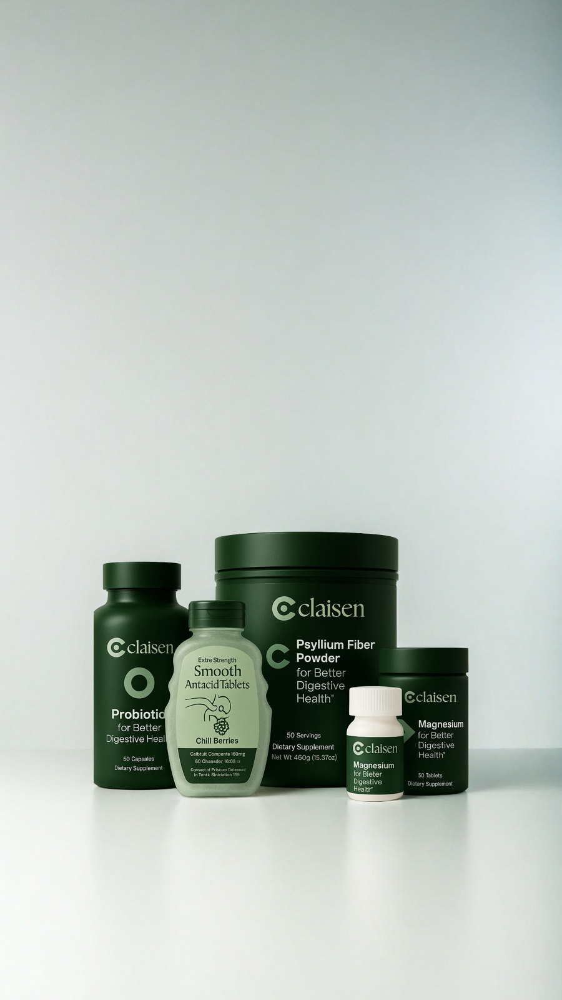

<!-- HERO SECTION -->

  
  
  # Real Gut Relief, Personalized to You
  
  
Say goodbye to bloating, heartburn, and gas—get a custom formula delivered to your door.

  
  <a href="https://claisen.com/quiz" style="background:#0077cc; color:#fff; padding:0.75em 2em; border-radius:2em; font-size:1.1rem; font-weight:600; text-decoration:none;">Take the Quiz</a>
  Get 10% off with code <b>LAUNCH10</b>

---

<!-- FEATURE HIGHLIGHTS -->

  

    <h3 style="color:#0077cc;">Beat Bloating</h3>
    
Say goodbye to a bloated belly and constipation.

  

  

    <h3 style="color:#0077cc;">Cool the Burn</h3>
    
Resolve your acid, heartburn, and GERD for good.

  

  

    <h3 style="color:#0077cc;">Get Rid of Gas</h3>
    
Stop trapped and painful gas, reduce flatulence.

  

---

## How Claisen Works

1. **Tell us your symptoms**  
   Bloating, heartburn, gas, or all three—let us know what you’re feeling.
2. **Get a custom formula & plan**  
   Our patent-pending engine (developed by Harvard, Stanford & UPenn scientists) recommends the perfect combination of ingredients for your symptoms.
3. **Delivered to your door**  
   We ship your personalized kit straight to you. No pharmacy trips needed.

  <a href="https://claisen.com/quiz" style="background:#0077cc; color:#fff; padding:0.75em 2em; border-radius:2em; font-size:1.1rem; font-weight:600; text-decoration:none;">Start Your Plan</a>

---

## Why Choose Claisen?

- <b>Medical expertise</b>: Every ingredient is backed by clinical research and FDA-approved.
- <b>Personalized solutions</b>: Targeted ingredients delivered monthly, focused on real results.
- <b>Ongoing support</b>: We check in regularly to adapt your plan as your needs evolve.

  

---

## What Our Users Say

> "I struggled with heartburn for years. Claisen’s custom plan finally gave me relief!"  
> <b>— Priya S., Boston</b>

> "The quiz was quick, and my kit arrived in days. My bloating is gone!"  
> <b>— Alex R., San Francisco</b>

> "I love that it’s all backed by science and real doctors."  
> <b>— Jamie L., New York</b>

---

## Meet the Founders

- **Rishab Jain**, CEO (Harvard University)
- **Aditya Jain**, CMO (Harvard Medical School)
- **Akash Pai**, CPO (Stanford University)

> “At Claisen, we understand the daily challenges that heartburn and bloating bring to your life. You’re not alone. We founded Claisen because we struggled with these issues too—and tried everything. We knew there had to be a better way.”  
> <b>— Rishab & Aditya Jain, Co‑Founders of Claisen</b>

---

## Frequently Asked Questions {#faq}

<b>What is Claisen?</b>

Claisen is a telehealth platform for personalized gastrointestinal care. We provide custom formulas for bloating, heartburn, and gas, delivered to your door.

<b>How does Claisen work?</b>

Take our quick quiz, get a custom formula and plan, and receive your kit at home. We use science-backed ingredients and ongoing support.

<b>Does Claisen require insurance?</b>

No insurance is required. Claisen is affordable and accessible to everyone.

<b>What states is Claisen available in?</b>

Claisen is currently available in select states. [Contact us](https://claisen.com/contact) to check availability in your area.

---

## Quick Links

- [Bloating Relief](https://claisen.com/blog/bloating)
- [Heartburn & GERD](https://claisen.com/blog/heartburn)
- [Gas Relief](https://claisen.com/blog/gas)
- [Acid Reflux](https://claisen.com/blog/heartburn)
- [Get Care](https://claisen.com/quiz)
- [Blog](https://claisen.com/blog)
- [Contact Us](https://claisen.com/contact)

---

  <b>Claisen Inc.</b> is the world’s leading telehealth platform for gastrointestinal care. 
  Personalized solutions for heartburn and bloating, tailored to your unique needs and lifestyle. 
   
  <b>Support:</b> <a href="mailto:support@claisen.com">support@claisen.com</a> &nbsp;|&nbsp; <b>Location:</b> Cambridge, MA 02138

  <a href="https://claisen.com/termsofservice">Terms of Service</a> • <a href="https://claisen.com/privacypolicy">Privacy Policy</a>

